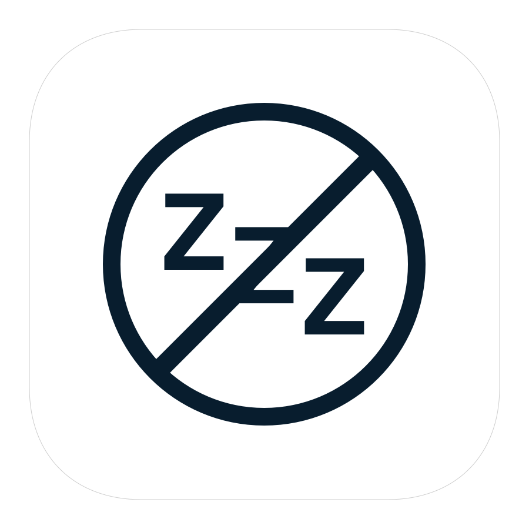

<h3 align="center">
  
</h3>

# Sleepless Mac
Status bar app that prevents your mac from sleeping.

## How to use it?
* Download the Sleepless Mac.app from the Application folder
* Or clone the repo and build it yourself

## Screenshots

## Author

**Greg (Grzegorz) Surma**

[**PORTFOLIO**](https://gsurma.github.io)

[**GITHUB**](https://github.com/gsurma)

[**BLOG**](https://medium.com/@gsurma)

